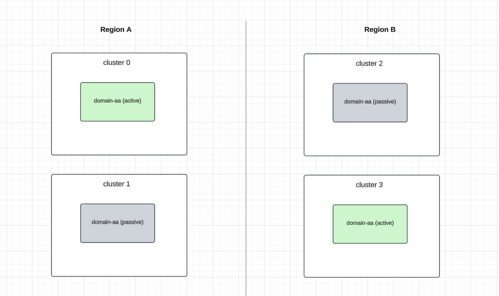

# Design doc: Cadence Active-Active

Author: [@taylanisikdemir](https://github.com/taylanisikdemir)

Last updated: Apr 2025

## Abstract

Multiple Cadence clusters can be configured to form a cluster group. Each cluster group can have multiple domains.
Currently domains are the smallest unit of isolation which supports two modes:

1. **Local Domain:** Only one cluster in the group hosts the domain. No replication.
2. **Active-Passive Domain:** Domain is active in one cluster and passive in other cluster(s). All workflows of the domain are replicated to other specified passive clusters. See [NDC doc](../2290-cadence-ndc.md) for more details.

This document describes the design and implementation of active-active domains which is a new mode where a domain can be active in multiple clusters but individual workflows are only active in one cluster at any given time.

## Background

The main drawbacks of Active-Passive approach are:

- **Cross region call forwarding:** Limiting domain to a single region may lead to cross region dependency in hot paths if the user wants to process requests in multiple regions. Passive regions will forward requests to the active region. This leads to increased latency, cost and potential timeouts.

- **Cross region data inconsistency:** Sticking with a single active Cadence region may lead to cross region data inconsistency issues for external data stores. Example:
  - A request originates in Region-0.
  - It writes something to a data store in Region-0 and starts a workflow for further processing.
  - Domain is active in Region-1 which means Cadence will forward requests to Region-1 and workers in Region-1 will process the workflow.
  - Worker in Region-1 is likely to read stale data from the data store in Region-1 because of eventual consistency of cross region data stores.

- **Underutilized workers in passive region(s):** Domain owners must deploy workers to both regions to be ready for failover. Workers in the passive region(s) stay idle. In the event of a failover, workers in the passive region(s) will need to scale up and if this is not done quickly, workflows will observe delays (potentially time outs).

- **Complexity of using multiple domains:** Current workaround to achieve active-active processing with Cadence is to create multiple domains and mark one of them active per region. E.g. domain-region0 and domain-region1. This requires users to remember which domain a specific workflow is created when they want to signal/describe the workflow. They can’t seamlessly create workflows in both regions for a single domain.


## Design

Active-active domains are a new mode of isolation where domain is active in multiple clusters but individual workflows are only active in one cluster at any given time. Users can create workflows in any of the active clusters under the same domain. Each workflow will be considered active in one of the domain's active clusters. The per-workflow active cluster selection mechanism will be dynamic/extensible to support different strategies.

Before diving into the details of active-active domains design, let's look at how active-passive domains work at high level. Then we will cover how active-active domains will be implemented in follow up sections.

### Active-Passive domain's failover version

As the name suggests, an active-passive domain is active in one cluster and passive in other clusters. All the workflows of the domain are replicated to other passive clusters. Active cluster is determined by the failover version of the domain in the database.

- Cluster group configuration:
```
clusterGroupMetadata:
    failoverVersionIncrement: 10
    clusterGroup:
        cluster0:
            initialFailoverVersion: 0
            ...
        cluster1:
            initialFailoverVersion: 2
            ...
```

Active-Passive domains take the initial failover version from the cluster group configuration when they are created based on their ActiveClusterName field in the domain configuration.


- Failover version in domain records:

Failover version is a property of active-passive domains which is updated as part of failover. Domain's failover version value uniquely maps to one of the clusters by using following formula: `domain.failoverVersion % clusterGroup.failoverVersionIncrement`. Let's look at an example:


| Domain | Failover Version |
|--------|------------------|
| Domain-A | 0 |
| Domain-B | 102 |

Domain-A is active in cluster-1 because failover version `0 % 100 = 0` which belongs to cluster-1 based on above configuration.
Domain-B is active in cluster-2 because failover version `102 % 100 = 2` which belongs to cluster-2 based on above configuration. Domain-B was failed over in the past, otherwise its failover version would be `0` or `2` (initialFailoverVersion in cluster group configuration).


### Clusters and Regions

There's no "region" concept in Cadence today. However, with active-active domains, we need to introduce the concept of regions. The constraints are going to be:

1. Each cluster belongs to one region.
2. There can be multiple clusters in a region.
3. A workflow of an active-active domain can ONLY be active in one cluster in a region.
4. A workflow of an active-active domain can be passive in any number of clusters in any number of regions.



The underlying reason for these constraints is mainly to reuse existing failover version to cluster mapping that relies on failover versions. By restricting active-active workflows of active-active domains to have only one active cluster per region, we can reuse the failover version mapping mechanism to determine the active cluster of a workflow.

Active-active domains do NOT have a failover version in the database because "activeness" is not a property of a domain. Instead, workflows of active-active domains will be associated with an "entity" which has a failover version based on the region.

The region information will be defined in cluster group configuration. e.g.
```
clusterGroupMetadata:
    primaryClusterName: cluster0
    failoverVersionIncrement: 100
    regions:  # new field.
        us-west:
            initialFailoverVersion: 1
        us-east:
            initialFailoverVersion: 3
    clusterGroup:
        cluster0:
            initialFailoverVersion: 0
            region: us-west
        cluster1:
            initialFailoverVersion: 2
            region: us-west
        cluster2:
            initialFailoverVersion: 4
            region: us-east
        cluster3:
            initialFailoverVersion: 6
            region: eu-west
```


Notice that regions also have a failover version now. This will be used to determine the active cluster of a workflow based on following lookups:
- Workflow maps to an entity (or directly to a region). This is static and cannot change over time.
- Entity maps to a region. This is dynamic and can change over time.
- Region maps to a cluster. This is static and cannot change over time. Note that there can be more than one cluster in a region but an active-active domain can only have one active cluster per region.

In other words,
- All workflows of active-passive domains use the failover version of the cluster that it is active in.
- Individual workflows of active-active domains use the failover version of the region that the entity that it is associated with belongs to.


Let's look at a few examples:

**Example 1:**
Assume that we have an active-active domain called "Domain-AA-Sticky-Region" which exists in multiple regions and would like to have its workflows be active in the region they are started. We think this will be the most common use case so it's going to be the default behavior.

**Example 2:**
Assume that we have an active-active domain called "Domain-AA-User-Location" which exists in multiple regions and runs workflows per user. Each user's workflow is supposed to be processed by the cluster closest to the user's current location. Users can move around which means their workflow's active cluster will change over time.


### Active cluster selection strategies

The active cluster per workflow selection strategies must support the examples given in the previous section and must be extensible to support other use cases. To drive such extensibility, we will introduce a new table called EntityActiveRegion to store <entity, region, cluster> mapping and the active cluster of each workflow (of an active-active domain) will be determined based on that information. The workflows themselves need to be associated with an entity which can be specified by the user in start workflow request.

1. Pick the cluster that received the start workflow request
   This is the default behavior and requires no additional configuration.

2. Pick the cluster based on an external entity specified in the start workflow request.
   This is useful when the user wants to dynamically change which cluster a workflow should be active in during the lifetime of workflow.
   e.g. In "Domain-AA-User-Location" example, a workflow that is started in cluster-0 but user moved to another region and the workflow needs to be active in cluster-1 going forward.


Workflow start parameters:

| Parameter | Description | Example |
|-----------|-------------|---------|
| active-region.lookup-source | Where to look up to determine the active region of the workflow for a given key. Ideally it should support the watch API. A corresponding watcher must be implemented within Cadence. | "custom.user-location-provider" |
| active-region.lookup-key | The key to look up from the above source. | "userid-123" |

The lookup source "custom.user-location-provider" is a custom provider that can be implemented by the user. Initially we are not going to define an RPC protocol for this and it has to be implemented within Cadence.


Workflow start request determines which cluster selection strategy to be used.

If both `active-region.lookup-source` and `active-region.lookup-key` are set, then the workflow will be associated with the entity specified and the active cluster will be determined based on that entity's region.

Otherwise, the default behavior is to pick the cluster that received the start workflow request.

### Workflow activeness metadata in execution table
A new row will be added to executions table as part of StartWorkflow LWT for active-active-domains. It will grab external entity source/key info from workflow’s headers if provided. If no such header is provided then current cluster’s region is stored as origin. These records are immutable and are replicated as part of regular per-shard replication tasks.

| Shard | RowType | Domain | WFID | RunID | Data |
|-------|---------|--------|------|-------|------|
| 1     | ActivenessMetadata | test-domain | wf1 | 123 | Origin=us-west |
| 2     | ActivenessMetadata | test-domain | wf2 | 456 | EntityType=user-location, EntityKey=london |


In the above example:
- `wf1` is created on us-west. No external entity associations exist. Its tasks will have failover version of the active cluster in us-west specified in domain's `RegionToClusterMap` which is 0.
- `wf2` is created with an external entity association. Its tasks will have failover version of following row in `EntityActiveRegion` table:
<type=user-location, key=london> which is 5. Its tasks will be processed by cluster3 because version 5 maps to us-east region and cluster3 is active in us-east.
- `wf3` is a long running workflow which was created when the domain was active-passive (migrated to active-active later on). It doesn't have an activeness metadata row in the executions table. Its existing tasks already have failover version of the cluster that it was active in so it will continue to be active in that cluster. Such workflows will continue to be processed with same failover version by the same cluster.

NOTE: Long running workflows of active-passive domains like `wf3` will required the active-active domain to include pre-migration ActiveClusterName in active cluster config. Migrating a domain from active-passive to active-active and removing existing ActiveClusterName from active cluster config will break such workflows.


### Domain records

Domain records will have a new field called ActiveClusters which contains the information about region to cluster mapping and failover versions of the clusters. Active-active domains will have this field set and ActiveClusterName field will be empty.
Active-passive domains will not have this field set and ActiveClusterName field will be set.

```
{
    // Clusters can be a subset of clusters in the group.
    Clusters: 	    [us-west, us-east, eu-west, eu-central],

    // Active clusters can have at most one from each region. Remaining clusters will be considered passive.
    ActiveClusters:  {
        RegionToClusterMap: {
            us-west: {
                ActiveClusterName: cluster0,
                FailoverVersion: 0, # failover version of cluster0.
            },
            us-east: {
                ActiveClusterName: cluster3,
                FailoverVersion: 6, # failover version of cluster3.
            },
        },
    },
}
```

**RegionToClusterMap:**

A map of regions to clusters that the domain can have active workflows in. It's initially formed based on cluster group configuration and given active clusters of the domain. Each region that the domain is active in will have an entry in this map.

Workflow task versions are assigned based on the failover version of the region that their associated entity belongs to.
If there's no entity associated with a workflow, then the task version is assigned based on the failover version of the region that the workflow is created on.

Active-passive domains can be turned into active-active domains by setting the ActiveClusters field. There can be open workflows with task versions mapping to a cluster failover version instead of a region failover version. Mapping logic will support this fallback to support migration from active-passive to active-active domains.

e.g.
A long running workflow of an active-passive domain has task in the queue with version 0. This is supposed to be active in cluster0.
If we make this domain active-active, the task version should resolve to:
- cluster0 if domain is active in cluster0 (direct mapping).
- cluster1 if domain is active in cluster1 (fallback to active cluster of the region).
- if domain has no active cluster in the region, then it's a resolution error and the task will not be processed as active anywhere.


### EntityActiveRegion Lookup Table
This table is used to lookup the active cluster of a workflow based on the entity that the workflow is associated with.

- Primary key of the table is <EntityType, EntityKey>
- A new plugin system will be introduced to watch supported entity types and populate the table
- Watchers are per cluster group
    - There’s one primary cluster for the group and watcher runs on that cluster
- This table is replicated to all clusters in the cluster group from the primary cluster
- Failover Version
    - Each entity record has a failover version to be used as workflow task versions
    - Initially set based on cluster metadata
    - Incremented based on Increment value from cluster metadata whenever mapping for a key changes


| EntityType | EntityKey | Region | Failover Version | LastUpdated |
|------------|-----------|--------|------------------|-------------|
| user-location | seattle   | us-west    | 1                |             |
| user-location | boston    | us-east    | 3                |             |
| user-location | london    | eu-west    | 5                |             |
| user-location | frankfurt | eu-central    | 7                |             |


This table is not domain specific so failover versions are not the failover versions of a cluster but instead the failover versions of a region. Region to cluster mapping is specific to domain.

Workflows associated with an entity will have task versions as indicated in the table above. Since these workflows are bound to a region, we cannot use the cluster failover versions.


### Failover scenarios

**1. Regional failover (disabling a region):**
This is a typical operation when the operator updates `ActiveClusterName` field in the domain record to failover the active-passive domain to one of the passive clusters.
It's called cluster failover because of active-passive domains where only one cluster can be active.

In the active-active domain context, this operation will be done by updating `ActiveClusters` field in the domain record. Arbitrary changes can be made to the `ActiveClusters` field as long as following criterias are satisfied
- it's a subset of clusters in the cluster group.
- it has at most one active cluster per region.

For example, let's say we want to failover cluster0 to cluster3. (us-west -> us-east).

Before failover:
```
ActiveClusters:  {
    RegionToClusterMap: {
        us-west: {
            ActiveClusterName: cluster0,
            FailoverVersion: 1,
        },
        us-east: {
            ActiveClusterName: cluster3,
            FailoverVersion: 3,
        },
    },
}
```

After failover:
```
ActiveClusters:  {
    RegionToClusterMap: {
        us-west: { // failover version of us-west region is changed to 3 so that it maps to us-east region.
            ActiveClusterName: cluster3,
            FailoverVersion: 3,
        },
        us-east: {
            ActiveClusterName: cluster3,
            FailoverVersion: 3,
        },
    },
}
```

Failover version to cluster mapping:
- Workflows whose task version resolves to region us-west will start using version 3 from now on.
- Workflows whose task version resolves to region us-east will continue using version 3.


**2. Within region failover (changing active cluster of a region):**

In the example active-active domain above, the cluster0 & cluster1 are available in us-west region and cluster0 is active.

If we want to failover from cluster0 to cluster1, then we need to update the `RegionToClusterMap` in the domain record and replace cluster0 with cluster1.

Before failover:
```
ActiveClusters:  {
    RegionToClusterMap: {
        us-west: {
            ActiveClusterName: cluster0,
            FailoverVersion: 1,
        },
        us-east: {
            ActiveClusterName: cluster3,
            FailoverVersion: 3,
        },
    },
}
```

After failover:
```
ActiveClusters:  {
    RegionToClusterMap: {
        us-west: {
            ActiveClusterName: cluster1,
            FailoverVersion: 2,
        },
        us-east: {
            ActiveClusterName: cluster3,
            FailoverVersion: 3,
        },
    },
}
```

Failover version to cluster mapping:
- Workflows whose task version resolves to region us-west will start using version 2 from now on.
- Workflows whose task version resolves to region us-east will continue using version 3.


**3. Entity failover:**

The external entity support is optional. If no entity is provided, the workflow will be associated with the region that the workflow is created on and they will be failed over as explained in the previous section.

If an external entity is provided for a workflow, then it can be failed over by updating the corresponding record in `EntityActiveRegion` lookup table.

Let's say we want to failover the entity with key "seattle" to region us-east so it gets processed by cluster3.

Before failover:
| EntityType | EntityKey | Region | Failover Version | LastUpdated |
|------------|-----------|--------|------------------|-------------|
| user-location | seattle   | us-west    | 1                |             |

After failover:
| EntityType | EntityKey | Region | Failover Version | LastUpdated |
|------------|-----------|--------|------------------|-------------|
| user-location | seattle   | us-east    | 3                |             |

Notice that the failover version is updated to 3. This means that all workflows associated with this entity will be considered active in us-east region from now on. Since there can only be one active cluster per region, the coresponding workflows will be active in cluster3.

Failover version to cluster mapping:
There's no change in the failover version to cluster mapping in entity failovers. Same versions map to same clusters as before.
However, new task versions of workflows belonging to "seattle" entity will be 3 from now on and therefore they will be active in cluster3.


### API Call Forwarding

Cadence frontend proxies some API calls to the active cluster of the domain. Currently, this request to cluster lookup is done by checking the failover version of the active-passive domain.
For active-active domains, the lookup will be per workflow based on the active cluster of the workflow.
Same set of APIs are going to be forwarded to the active cluster.

#### APIs that are not subject to forwarding. Always served by current cluster:

- Cluster APIs
    - Health
    - GetClusterInfo

- Visibility APIs
    - CountWorkflowExecutions
    - GetSearchAttributes
    - ListArchivedWorkflowExecutions
    - ListClosedWorkflowExecutions
    - ListOpenWorkflowExecutions
    - ListWorkflowExecutions
    - ScanWorkflowExecutions

- Domain APIs
    - DeprecateDomain
    - DescribeDomain
    - RegisterDomain
    - UpdateDomain
    - ListDomains

- Tasklist APIs
    - DescribeTaskList
    - ListTaskListPartitions
    - GetTaskListsByDomain
    - ResetStickyTaskList

- Worker APIs
    - PollForActivityTask
    - PollForDecisionTask
    - RespondDecisionTaskCompleted
    - RespondDecisionTaskFailed
    - RespondQueryTaskCompleted

- Per workflow APIs
  - RestartWorkflowExecution
  - RequestCancelWorkflowExecution
  - RefreshWorkflowTasks
  - DiagnoseWorkflowExecution
  - SignalWithStartWorkflowExecutionAsync
  - StartWorkflowExecutionAsync

Note: Async API calls might be ok without forwarding (current state). We want these to be low latency and high throughput. So better to avoid checking workflow execution records. This means potentially duplicate workflow creations in active-active mode if user retries in multiple regions. Check the reconciliation logic that is supposed to dedupe these. We may revisit this in the future.

#### APIs that are forwarded to active side (selectedAPIsForwardingRedirectionPolicyAPIAllowlistV2):

- Per workflow APIs
  - StartWorkflowExecution
  - SignalWorkflowExecution
  - SignalWithStartWorkflowExecution
  - ResetWorkflowExecution
  - TerminateWorkflowExecution
  - QueryWorkflow: Forwarded to active cluster if strong consistency parameter is set to true.
  - DescribeWorkflowExecution: Forwarded to active cluster if strong consistency parameter is set to true. (This is not supported as of Apr 2025 but the work is in progress.)
  - GetWorkflowExecutionHistory: Forwarded to active cluster if strong consistency parameter is set to true. (This is not supported as of Apr 2025 but the work is in progress.)

- Worker APIs
  - RecordActivityTaskHeartbeat
  - RecordActivityTaskHeartbeatByID
  - RespondActivityTaskCanceled
  - RespondActivityTaskCanceledByID
  - RespondActivityTaskCompleted
  - RespondActivityTaskCompletedByID
  - RespondActivityTaskFailed
  - RespondActivityTaskFailedByID


### Entity mapping updates

There are two categories of entity types:

1. Domain/region entities
2. User defined entities

Domain/region entities are entities that are managed by default domain plugin as part of typical domain operations.
- Domain creation: Populate EntityActiveRegion table with `{domain}.{region}` for all regions in `ActiveClusters` list.
- Domain update: Update EntityActiveRegion table with `{domain}.{region}` for all regions in `ActiveClusters` list. Increment failover version based on region failover version and increment value from cluster group configuration.
- Domain deletion: Delete all relevant rows from EntityActiveRegion table.

User defined entities are entities that are defined by the user and are used to associate workflows with an external entity. Corresponding watcher implementation will be provided by the user. It should perform CRUD operations on EntityActiveRegion table following similar pattern to domain/region entities.

Entity updates are replicated to all clusters and history service will subscribe to these updates to notify task queues. This is similar to how domain failover changes are handled today. Notifying the task queues wake up the queues to resume processing and they will be able to apply active/standby logic based on new failover versions.


## Limitations

Below is a list of limitations of active-active domains.

- **Passive side tasklist processing:** Tasklist processing will be disabled for workflows that are passive in a cluster.
This is to avoid mixing tasklists of a domain with active and passive tasks. Instead, workflows will resume processing after failover by relying on decision/activity timeout tasks.
Misconfigured (very high) timeout values can lead to workflows not being processed for a long time which is already a risk in active-passive mode.

- **Workflow id conflict:** Multiple clusters can start workflows independently with the same workflow id. This can lead to conflicts in active-active mode.
Conflict resolution mechanism should take care of this by terminating one of the workflows.

- **External entity cardinality:** All cadence frontend and history services will have to make quick decisions on which cluster a workflow is active in. This requires caching all the domain data (already done for active-passive domains) and also caching the new entity region lookup table. This cache should be manageable in terms of memory usage so there will be a limit to the number of entities. Actual limit is going to be configurable based on available memory but ideally it should be in the order of thousands.

- **Graceful failover:** Graceful failover is not supported for active-active domains. It is not a mode that is frequently used for active-passive domains either.
