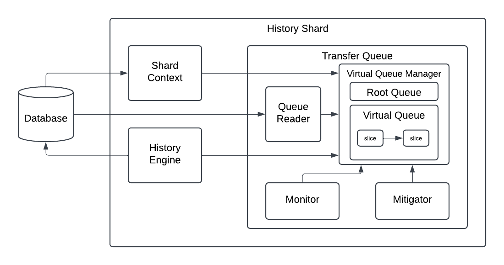

# Design doc: History Queue V2

Author: [@Shaddoll](https://github.com/Shaddoll)

Last Updated: Jun 2025

## Abstract

Cadence is a multi-tenant workflow orchestration platform used by multiple customers. It currently runs three types of history queues within the History Service: the transfer queue, timer queue, and replication queue. These queues are responsible for:

- Loading history tasks from database
- Submitting history tasks to history task scheduler for task execution
- Periodically persisting queue states (i.e., processing checkpoints) to the database so they can be resumed upon shard restarts

History Queue V1 suffers from poor isolation between domains, leading to noisy neighbor issues. Additionally, its implementation is poorly structured and prone to bugs.

History Queue V2 aims to replace V1 with a more robust and testable design, offering better code quality and improved task isolation.

## Architecture

Let's take transfer queue as an example. The above diagram displays the architecture of history queue v2.
## Implementation Details

Below is a breakdown of the main components, ordered from low-level to high-level:

**Virtual Slice**: This is the atomic component responsible for loading tasks from database with a given range and filter.

**Virtual Queue**: This is the component running a background job calling virtual slice to load tasks from database and submit history tasks to history task scheduler for execution. It has multiple virtual slices ordered by their range and they don't have any intersection. And the background job processes virtual slices sequentially in the order of task range.

**Virtual Queue Manager**: This is the parent component of virtual queues. Since each virtual queue has its own background job, they are isolated and that's how we achieve isolation in history queue v2. Inside a virtual queue manager, there is at least a root virtual queue component and optionally, there might be some other virtual queues. Virtual queues can be dynamically created and destructed, and the intersection of tasks processed by different virtual queues should be none. By default, there is only 1 root virtual queue.

**Queue Reader**: This is the component responsible for reading tasks from database on demand and it's shared by all virtual slices in the history queue v2 instance.

**Monitor & Mitigator**: Monitor is a component checking the queue processing of virtual queues and making decision to create new virtual queue. Mitigator is the component to perform the decision made by monitor. These 2 components won't be implemented in the initial release of history queue v2.

**Transfer Queue**: This is one instance of history queue v2, which is responsible for the critical jobs of transfer tasks. There is also timer queue and replication queue today and new category of history queues will be created in future.
